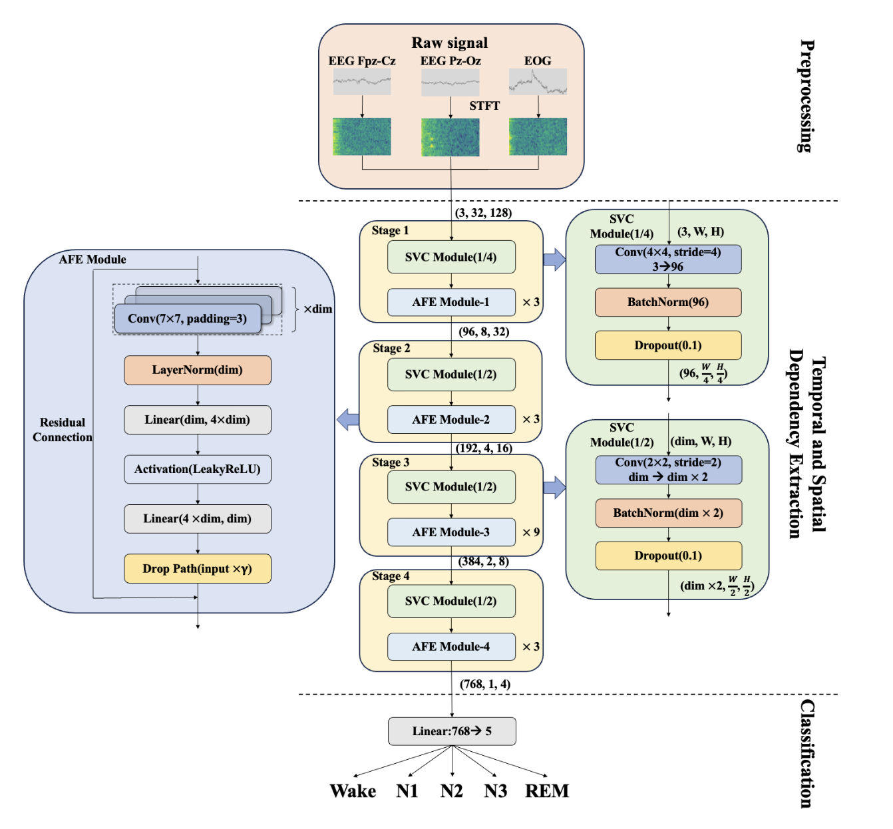

# FlexibleSleepNet

### Model Overview

### Pre-trained weights

The pre-trained weights are stored on Google Drive. You can download them from the following link:

[Download FlexibleSleepNet pre-trained weights](https://drive.google.com/drive/folders/1K0NtJseSqWwUZsN3yU7VkARq3TLDZGNL?usp=sharing)

### Requirement

python >= 3.9

PyTorch >= 2.1.2

Pytorch-cuda == 12.1

